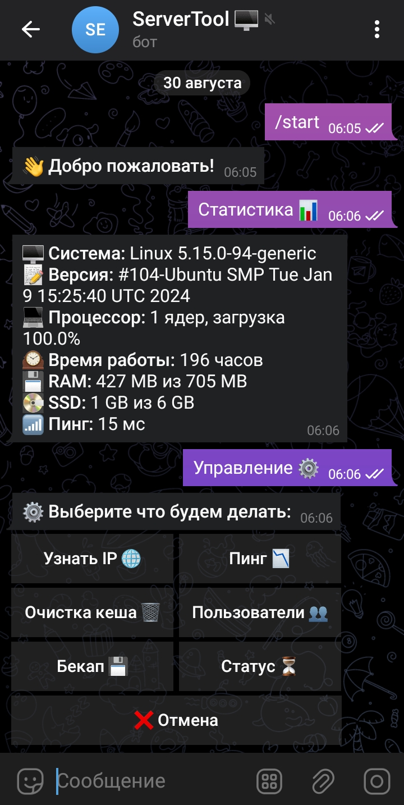

# ServerTool 📊⚙️

**ServerTool** - это удобный инструмент для управления вашим сервером через Telegram! Используйте этот бот для выполнения shell-команд, получения информации о нагрузке системы и многого другого.

## Пример интерфейса 📱

Вот как выглядит интерфейс бота на мобильном устройстве:



## Функции 🚀

- **Статистика** 📈: Получите текущую информацию о системе, включая загрузку процессора, использование памяти, пинг и сетевые интерфейсы.
- **Управление** ⚙️: Очистите кеш, узнайте пинг, получите IP-адрес и создайте резервные копии.
- **Логи** 📋: Просматривайте логи различных сервисов, таких как Auth, Python, Nginx, Apache, Squid и Dante.
- **Выполнение команд** 🕹️: Отправляйте команды для выполнения в терминале и получайте результат.
- **Помощь** 📚: Получите описание всех доступных команд.

## Установка 🔧

1. Клонируйте репозиторий:

    ```bash
    git clone https://github.com/KingApkSoftGG/ServerTool.git
    ```

2. Перейдите в директорию проекта:

    ```bash
    cd ServerTool
    ```

3. Установите зависимости:

    ```bash
    pip install -r requirements.txt
    ```

4. Настройте бота:

    Откройте файл `main.py` и укажите API токен вашего бота и ID владельца:

    ```python
    API_TOKEN = 'ТОКЕН' #ВАШ ТОКЕН ИЗ @BOTFATHER
    OWNER_ID = АЙДИ #ВАШ ТЕЛЕГРАМ АЙДИ
    ```

5. Запустите бота:

    ```bash
    python main.py
    ```

## Справка и поддержка 📬

Если у вас возникли вопросы или проблемы, создайте issue в этом репозитории или свяжитесь с нами через Telegram.

## Лицензия 📜

Этот проект лицензирован под MIT License. См. файл [LICENSE](LICENSE) для получения дополнительной информации.

---

Приятного использования **ServerTool**! 🎉